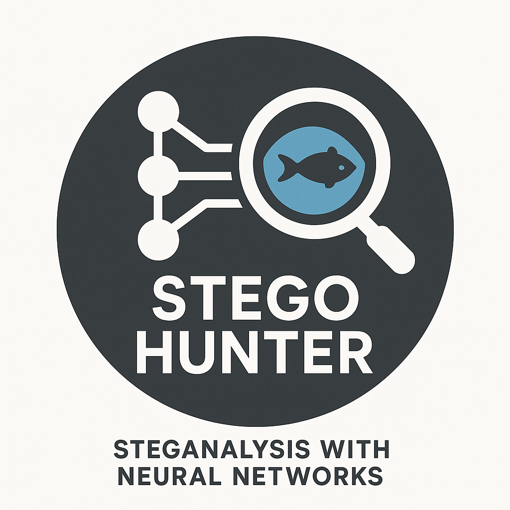

# 🕵️‍♂️ StegoHunter

<p align="center">
  
</p>

**StegoHunter** è un progetto di ricerca sviluppato in **Python** per la **rilevazione e classificazione di immagini steganografate** tramite la tecnica **LSB (Least Significant Bit)**. Il sistema sfrutta tecniche di **visione artificiale** e **machine learning** per identificare la presenza di dati nascosti all’interno di immagini RGB, con particolare attenzione ai pattern di alterazione generati da tecniche steganografiche bit-level.

## 🎯 Obiettivi

- Rilevare la presenza di **informazioni nascoste** in immagini RGB attraverso tecniche LSB.
- Classificare automaticamente le immagini in **clear** (originali) o in una delle **8 varianti steganografiche**.
- Esplorare architetture di rete leggere e adatte alla steganalisi.
- Valutare l'efficacia della classificazione su **dataset reali e standardizzati**.

## 📚 Descrizione tecnica

Il progetto si basa su una pipeline di analisi articolata nei seguenti passaggi:

- 🔍 **Pre-processing**:
  - Conversione dell'immagine e normalizzazione.
  - Separazione e analisi dei canali R, G, B.
- 📐 **Estrazione di feature implicite**:
  - Mediante convoluzioni focalizzate su pattern locali che evidenziano alterazioni tipiche delle tecniche LSB.
- 🧠 **Modello di classificazione**:
  - Rete neurale convoluzionale leggera, con strati progressivi di convoluzione, normalizzazione e attivazione, seguiti da una sezione fully-connected.
  - **Output multiclasse**: 9 etichette corrispondenti a:
    - `clear` (immagine non manipolata)
    - `stego_1` ... `stego_8` (otto varianti di steganografia LSB differenti)

## 🧠 Architettura del modello

L’architettura implementata è una **CNN a bassa complessità**, strutturata come segue:

- Blocchi **Conv2D** con kernel 3x3 e stride 1, seguiti da:
  - Batch Normalization
  - Attivazione ReLU
  - MaxPooling
- Sezione finale:
  - Flatten
  - Fully Connected Layers
  - **Softmax a 9 neuroni** per classificazione multiclasse

L'intera architettura è progettata per mantenere **basso il numero di parametri** e ridurre l'overfitting, data la natura altamente strutturata della manipolazione LSB.

## 🧪 Dataset utilizzati

Il modello è stato addestrato e validato su un dataset costruito fondendo:

- 📷 **STL-10**: immagini RGB originali, ad alta variabilità visiva.
- 📂 **BOSSBase 1.01**: immagini ad alta qualità usate comunemente nella steganalisi.

Dopo la fusione, le immagini sono state suddivise in modo da:

- Mantenere una frazione come classe `clear` (non modificata).
- Applicare **ciclicamente** le **8 tecniche LSB** sulle restanti immagini per generare le classi `stego_1` ... `stego_8`.

✅ Questo processo ha permesso di **bilanciare equamente le 9 classi**, evitando problemi di sbilanciamento (class imbalance) tipici nei task di steganalisi.

## 🛠️ Requisiti

- Python 3.11+

Installa tutto con:

```bash
pip install -r requirements.txt
